# Organizational Capacity and Candidate Emergence: the Case of Union Members as Candidates for Public Office

# Research Question and Motivation: Why Candidate Emergence?
* Candidate emergence is a crucial first step of representation. (Fox and Lawless 2011; Fraga, Juenke and Shah 2020; Maisel and Stone 1997)
* Understanding how organizational activities can explain their memebers' behavior/participation is imoprtant 
* Legislators' personal preferences, experiences, and identities often influence their policy making, accessibility, and representation. (Burden 2007; Carnes 2018; Lowande, Ritchie and Lauterbach 2019)

# Background: What explains candidate emergence?
* Among various forms of political behaviors, participating in politics directly as a political candidate is a relatively rare but crucial form of behavior.
* Strength in numbers
* Both "voter demand" and "candidate supply" sides of candidate emergence literature speak to strength in numbers as predictive of candidate emergence. (Branton 2009; Juenke, Gonzalez, and Shah 2016) 
* The likelihood of minority descriptive representation increases as the district-level minority population increases. (Barreto, Segura, and Woods 2004; Branton 2009;  Lublin 1997)
    

  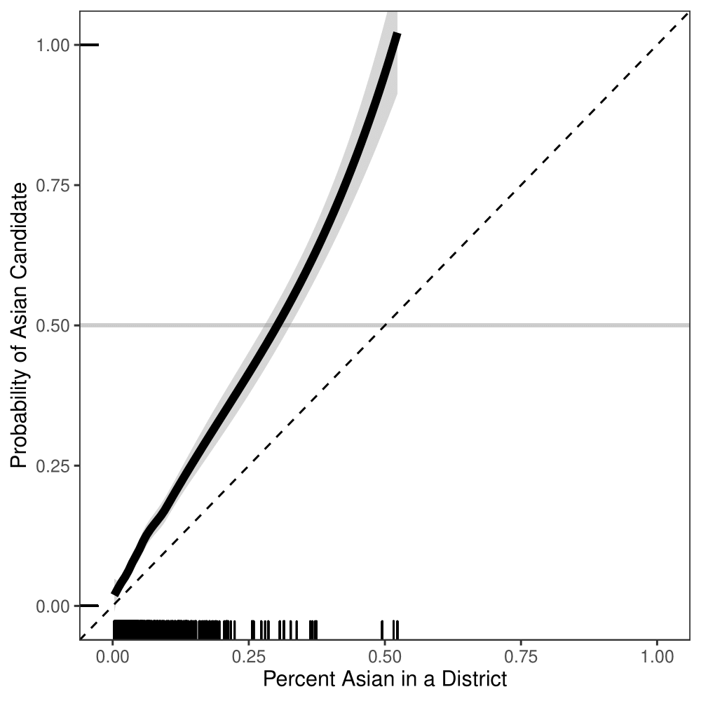

  # What explains candidate emergence? an alternative theory
* Institutions & organizations
* Organizations can promote political involvement of their members. (Andrews et al. 2010; Brady, Verba, and Schlozman 1995; Tate 2018)
* Parties and interest groups engage in candidate selection and nomination. (See Bawn et al. 2012; Frendreis, Gibson and Vertz 1990; Seligman 1961)
* Elites' personal encouragements (i.e., as organizational incentives) can facilitate people to enter politics. (Broockman 2014; Carnes 2018; Fox and Lawless 2010)
* However, skepticism: Organizations and Institutions?
    * Whether and how can parties and organizations provide selective incentives to foster candidate emergence? (See Maisel 2001; Carson, Engstrom and Roberts 2007; Cox and Katz 2002)

  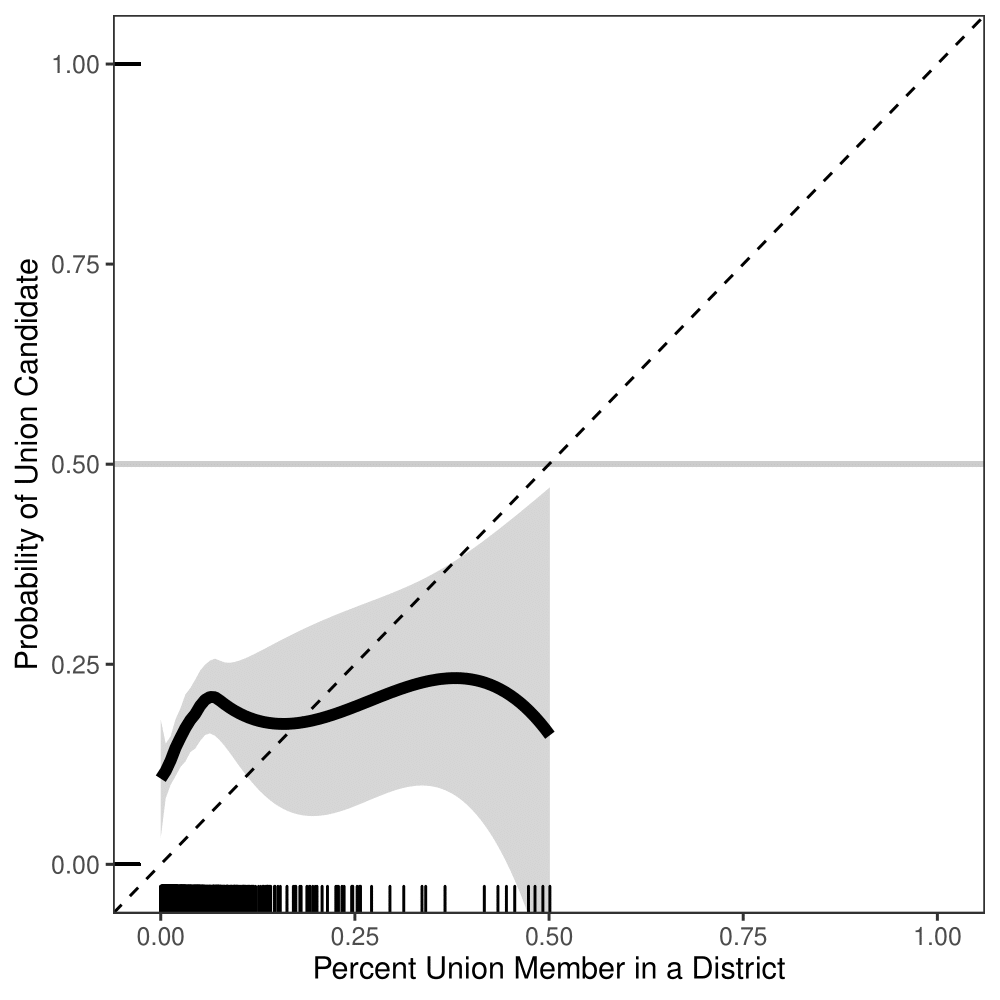

  
  
# Theory 
Organizations incentivize their members to run with organizational capacity. Then, how does candidate emergence operate within organizations? I argue that organizations can facilitate their members to run for office when organizations incentivize their members by providing political capital (indirect support) and monetary resources (direct support) with their organizational capacity.

  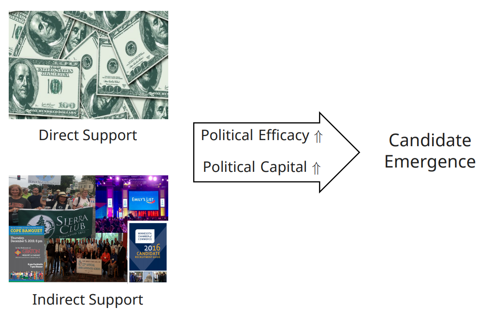

# Case Selection: Unions and Candidates with Union Experience (Union Candidates) 
* Political activity of organizations (Ahlquist and Levi, 2013; Jackson and Engel, 2003)
* Variations in organizational activities and capacities at the local level (Becher, Stegmueller and Kappner 2018; Lichtenstein 2013)
* Practicality and transparency (Aaron 1960; Wilcox and Iida 2010)

# Hypotheses
* Unions' aggregated support → Union candidate emergence 
* Unions' direct support → Union candidate emergence 
* Unions' indirect support → Union candidate emergence 

# Data
  # Outcome variable
A binary variable that shows whether there is at least one union candidate who runs for U.S. House primaries in a district or not in 2008, 2010, and 2012  

  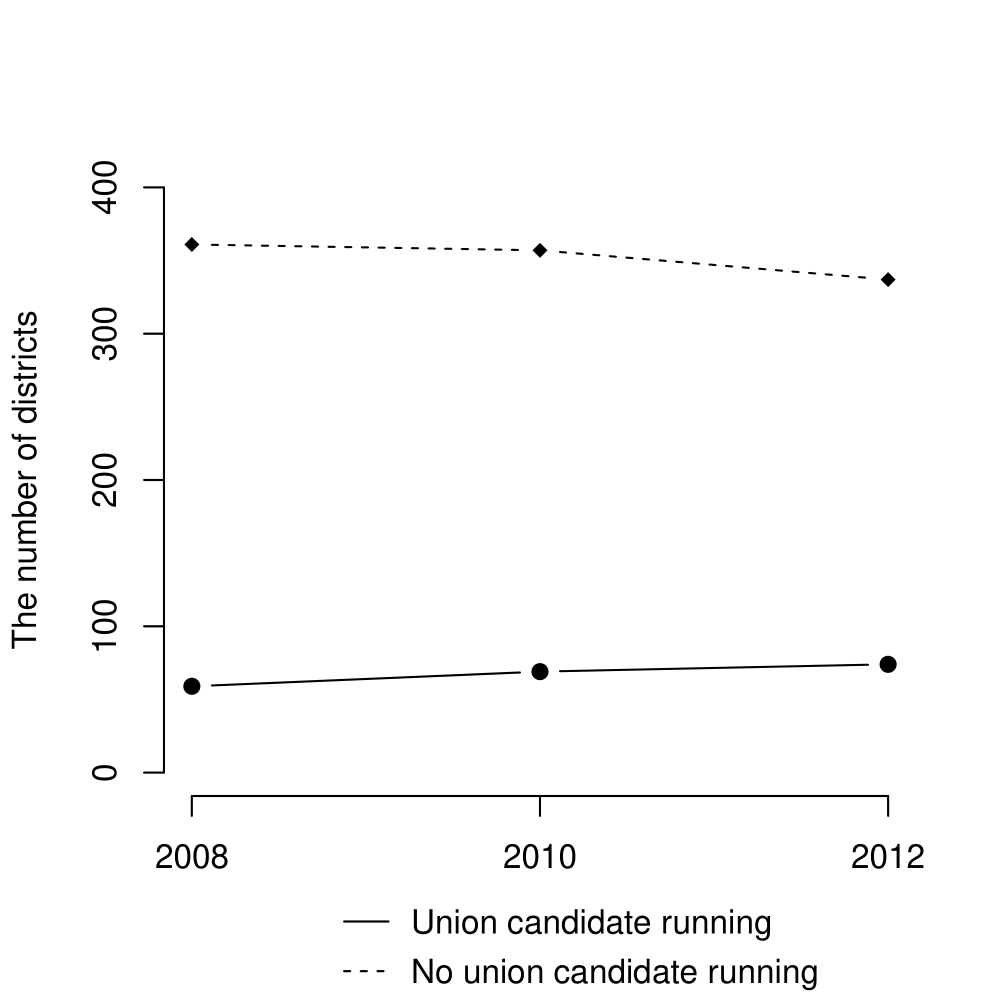
  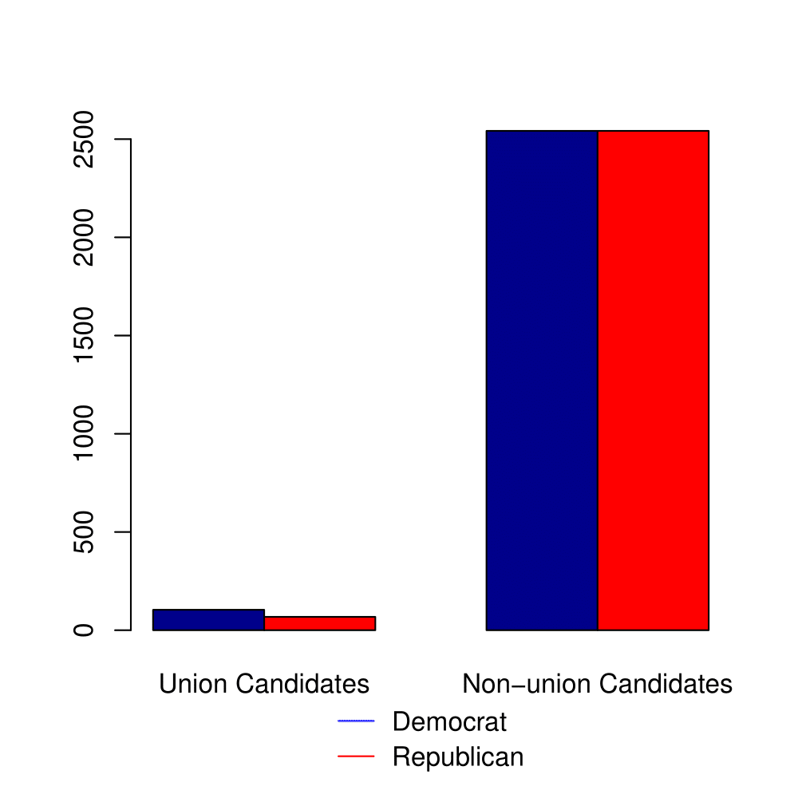

  # Explanatory Variables
Using a large administrative data (Labor-management forms), I can locate each local union units in congressional districts. Also based on coordinate matching, I can estimate the number of union members in each congressional districts. Lastly, based on geo-located union units in congressional districts and each union units' unique ID, I can estimate their political spending from the labor-management forms. The estimates are visualized below.

* Aggregated Support 
  * Aggregated political spending (logged$)
* Direct Support
  * Political spending (logged $) on campaign contributions, lobbying, and donations
* Indirect support
  * Political spending (logged $) on campaigns and elections, education, training, consulting and professional services, events, and other activities

  # Measuring Indirect and Direct Support
1. Geo-code local unions' addresses and locate them in congressional districts

|Union Name   |Members | Year |Street Address | **RPT ID** |
|-------------|---------|------|--------------|-----------|
|NATIONAL PRODUCTION| 1737 | 2008        | 2210 MIDWEST ROAD  |401105| 
|A M P I EMPLOYEES UNION  |159       | 2008       | 312 CENTER ST        |388379  |
|AERONAUTICAL EXAMINERS     | 187      | 2008       |103 SPRING RIDGE COURT    |406306 |
|AERONAUTICAL EXAMINERS    | 99       | 2008       | 1128 TEBO ROAD|375783|
|AERONAUTICAL EXAMINERS     | 81      | 2008        | ORANGE PARK| 391176 |  
|AFSCME COUNCIL |45      | 2008        | 3325 CAPRICIO STREET NE    | 401148     |
|AGRICULTURE EMPLOYEES        | 3       | 2008        |88 SWEET PEA LANE   | 374355  |
|...       | ...      | ...        |...   | ...  |

2. Classify each expenditure record

|Disbursement Type| Purpose                            |  Date      |Amount  | **RPT ID** |
|-------------------|----------------------------------|----------|---------|------------|
|504                | 2007 YEAR END AUDIT              | 10/17/2008  | 8300    | 383832  |
|502                | DONATION                         | 2/28/2008   | 10400   | 363172  |
|502                | Election 08' Political Training  | 4/15/2008   | 5587    | 369215  |
|503                | PROMOTIONAL JACKETS              | 10/19/2007  | 6467    | 369259 |
|...               | ...              | ...  |...   | ... |

3. Match unions' characteristics data and disbursement data

4. Aggregate these data into congressional district-level during the pre-primary period
   * e.g. For 2010 primary elections, I aggregate spending from 2009 to 2010 ballot access date for primaries
   
# Location of Unions

  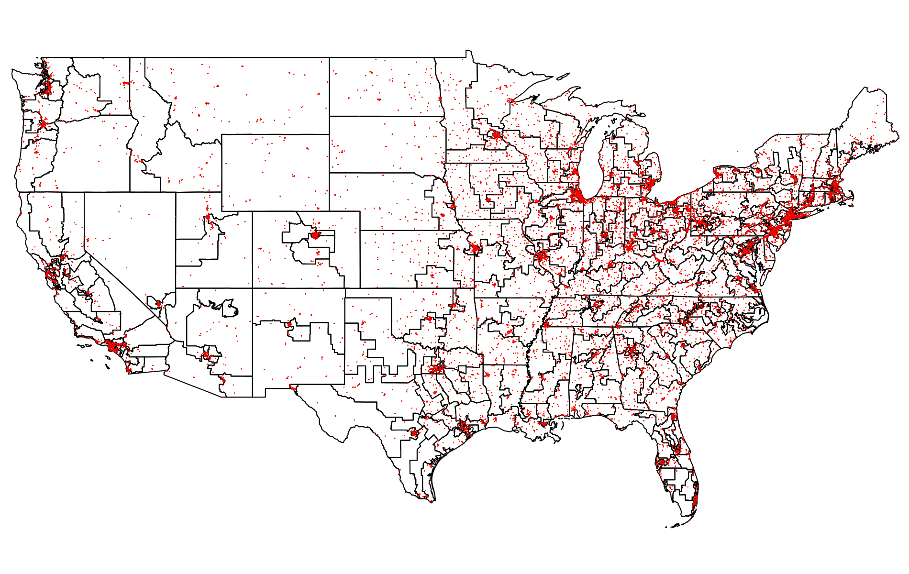

   
# Union Membership

  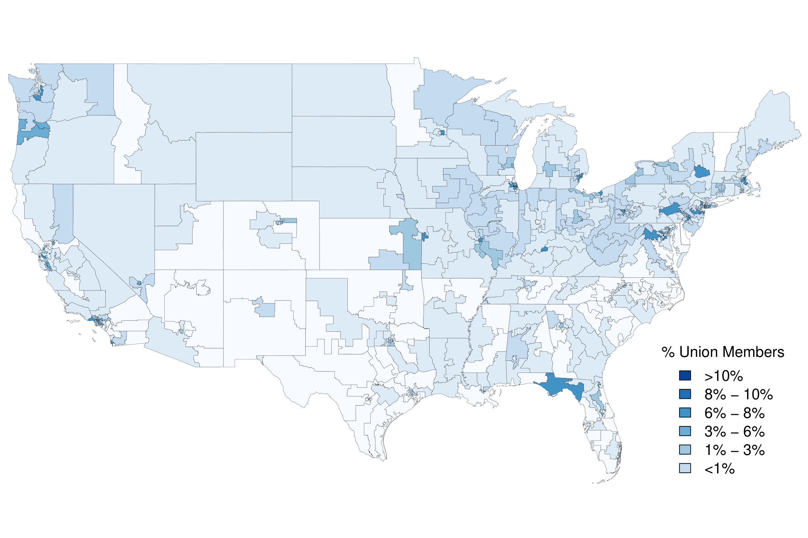

# Unions' Political Spending

  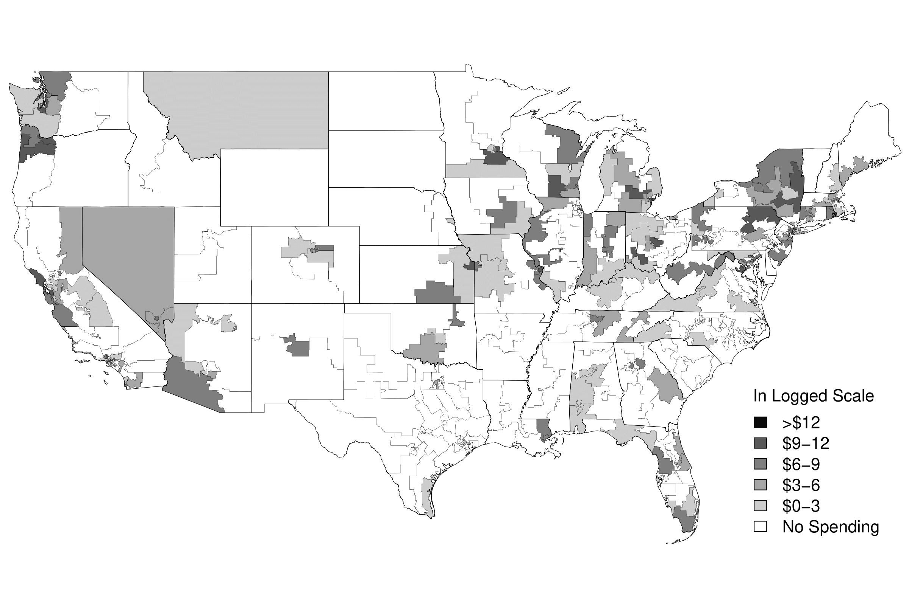

# Design
It would be ideal to randomly assign unions' organizational incentives (treatment) to individuals to compare against controls, however this design is not feasible for my study. Therefore, I examine my theoretical argument with a series of analyses of district-level data with two identification strategies. First, by exploiting panel data, I use logit regression with fixed effects to examine the relationship between unions' support and the likelihood of union candidate emergence (e.g., regression models with fixed effects are widely used to estimate causal inference in social science \citealt{angrist2008mostly}). Second, I use a matching method for causal inference with Time Series Cross Sectional (TSCS) data (a non-parametric generalized difference-in-differences estimator) proposed by \citet{imai2018matching} as robustness checks.\footnote{I also show a series of robustness tests in the Appendix B, but I only present the outcomes of a matching method with TSCS data in text.} Additionally, such matching offers robust results even when there are concerns of model dependence. 

Logit regression
* Unit of analysis: District level
* Year and state fixed effects (exploiting panel data)
* Dependent variable: At least one union candidate is running in a district (binary)
* Explanatory variables: Indirect, direct $\&$ aggregated support (logged $\$$ of unions' spending during pre-primaries)
* Control variables (district-level)

Robustness tests with other modeling strategies (other identification strategies for inference)
* Matching
  * Regular matching (Propensity Score and Mahalanobis Distance Matching: Nearest Matching with Adjusted Balance)
  * Matching with time-series-cross-sectional data
    * One of the problems in regular matching is that it cannot consider time-series-cross-sectional characteristics of data. I will futher discuss this issue and matching method to address this issue in the below section.
  * Coarsened Exact Matching (CEM)
    * The specific statistical goal is to estimate some version of a causal effect, such as the sample average treatment effect on the treated (the “SATT”). I used theoretically important six variables to use CEM (number of union members, open seat, number of unions, percent White, Percent BA or higher, Democratic presidential vote share). The matched pair after adjusting balance is 106.24 I used cem package. 
  * Continuous Treatment with Covariate Balancing Generalized Propensity Score (CBGPS) Estimation
    * As Fong et al. (2018) described, the main benefit of CBGPS is, a researcher can use continuous treatment variable with a matching.
    

Additionally, I used various matching methods to check robustness of findings. Although unions form to serve economic purposes rather than political purposes \cite{ahlquist2013interest,ahlquist2013interest,iversen2015information}, union spending for political activities (i.e., the measures for unions' institutional support in this paper) is not randomly assigned. Consequently, alongside controlling for demographic, political, institutional, and industrial characteristics of a district, I use a matching strategy to achieve balance between the treatment (institutional support) and control (no institutional support) groups on a set of relevant variables, matching on identified essential covariates (the number of unions, the number of union members, open seat, percent white, percent BA or higher, and recent Democratic Presidential vote share.)\footnote{To apply matching methods, I simplify my main explanatory variables (indirect and direct support (i.e., theoretical treatment variables)) to binary treatment variable. It means that if unions provide either way of institutional support (either indirect or direct support) in any level in a given district, I code the district is "treated". Conversely, if unions did not provide any support in a given district, the district is "controlled". I also run models with "continuous" treatment, continuous treatment with Covariate Balancing Generalized Propensity Score (CBGPS) estimation in the Appendix \cite{fong2018covariate}.} (see the Appendix (B.3) for detailed discussion of balance and weights.) 

Although the matching method improves the validation of causal inference in observational studies by reducing model dependence, until recently scholars have not applied matching method to analyze TSCS data \cite{imai2018matching}. This method first matches each treated observation with control observations from other units in the same time period that have an identical treatment history up to the pre-specified number of lags.\footnote{In this paper, I do not have many repeated measures (three time periods), I use only one lag.} Basically, this method allows us to consider the TSCS aspect while matching treated and controlled within the same time period that has treatment history. Then, I can use standard matching and weighting methods to further refine this matched set so that the treated observation has outcome and covariate histories similar to those of its matched control observations. After a refinement, I estimate the average treatment effects using the difference-in-differences estimator \cite{imai2018matching}.\footnote{ This matching method for TSCS data can address issues in the regular matching method (i.e., the regular matching method does not consider TSCS nature of data.) However, because I have only three different time periods (2008, 2010, and 2012), applying this method with \texttt{PanelMatch} to my study has limitations.}

* Instrumental Variable (Right-to-Work Laws)

Right-to-work laws can decrease the political spending of unions \cite{feigenbaum2018bargaining}. Also, this paper finds that the political spending of unions can increase the likelihood of union candidate emergence. These findings provide an opportunity to use instrumental variable as the presence of Right-to-work laws in each states. There are concerns of the violation of "exclusion restriction", using this instrumental variable approach, but the preliminary outcome shows that unions' institutional support can have causal effect on union candidate emergence.

# Results

For my main analysis, I used logit regression with state and year fixed effects to examine the relationship between unions' indirect support and the likelihood of union candidate emergence. Figure 3 (a) shows the predicted probability of union candidate emergence. Most of data are distributed around logged \$8 to \$14 as the figure presents. In this range of support, the probability of union candidate running in a district increases about 10 percentage points. Substantively, this is a relative modest size of effect, but in the aggregated level over many districts, the size of effects could be larger. Figure 3 (b) shows the relationship between unions' direct support and the predicted probability of union candidate emergence. The estimated effect is similar to the finding of indirect support. Figure 3 (c) presents the marginal effect of aggregated political spending on both indirect and direct support on predicted probability of union candidate emergence. Overall, the results show that organizations' capacity to incentivze their members can increase the probability of their members entering politics.

The solid black line is fit to local unions' political spending and the probability of at least one union candidate in the district's primary elections. Each line is a LOESS fit to the binary outcome data, with a 95\% confidence interval with dotted lines. Distribution of aggregated local unions' political spending in district-level during pre-primaries. The figure used a pooled sample of congressional primaries from 2008 to 2012.

  # Marginal Effect of Unions' Aggregated Support on Union Candidate Emergence

  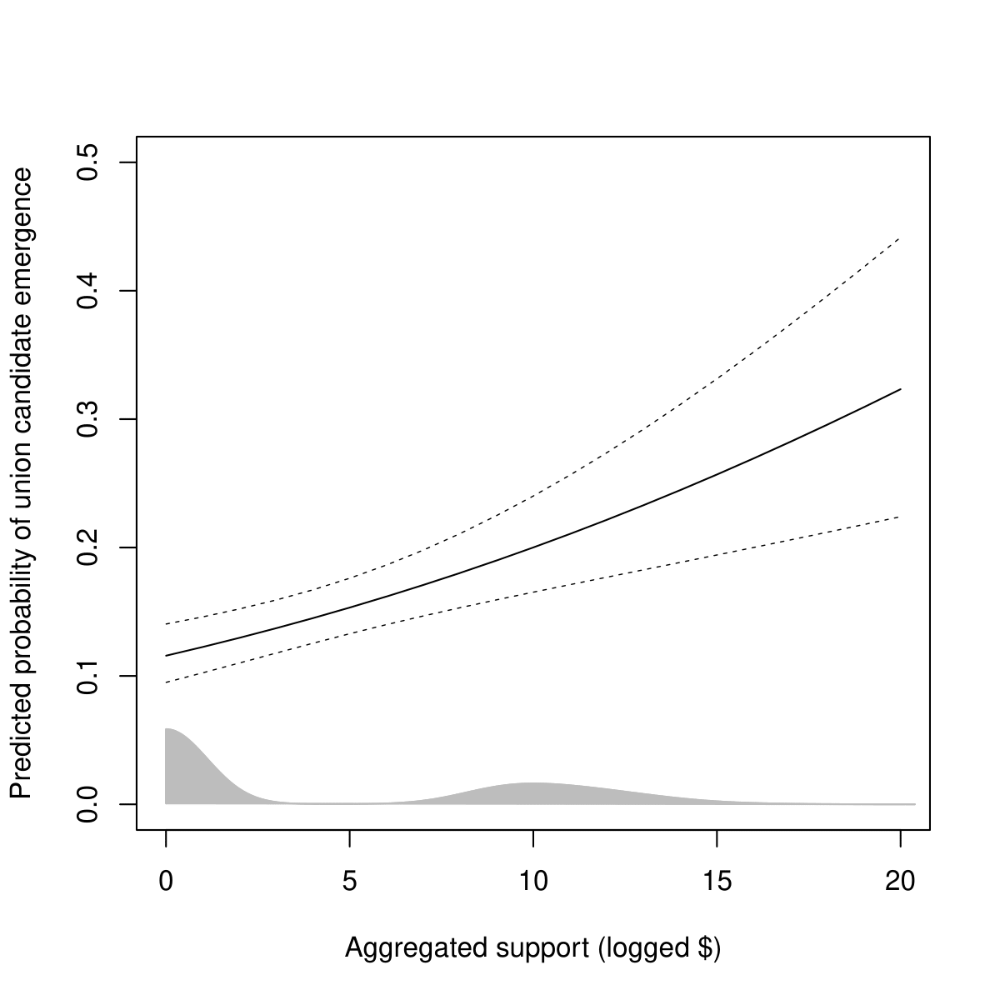

  # Marginal Effect of Unions' Indirect and Direct Support on Union Candidate Emergence

  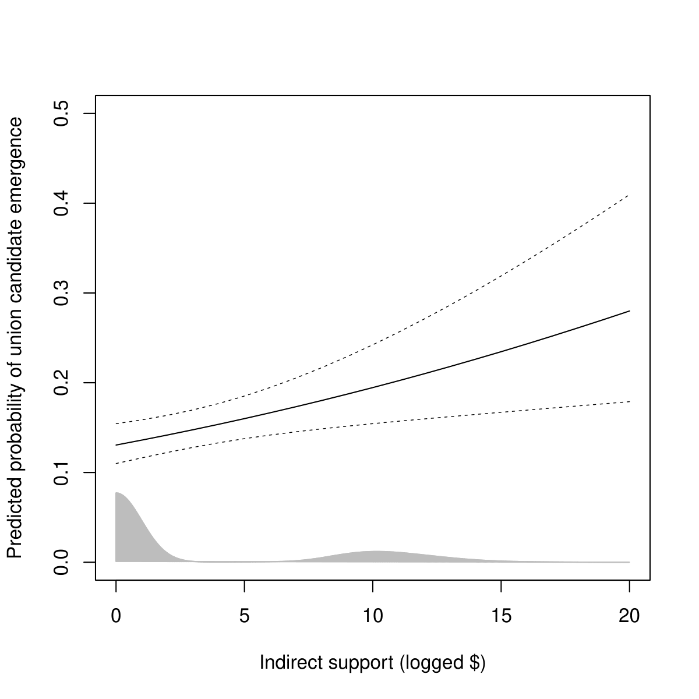
  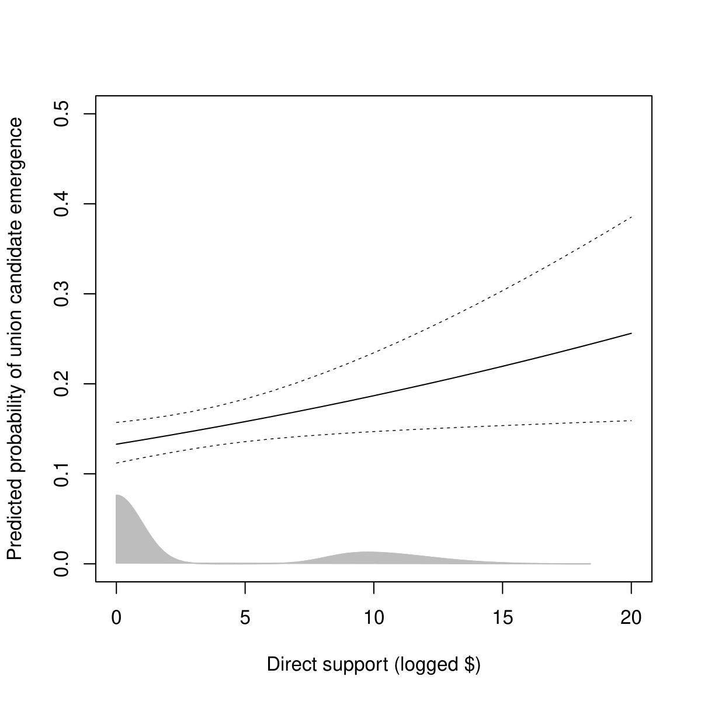

  # Different Types of Unions' Expenditures and Union Candidate Emergence
Further, to examine both indirect and direct support from unions more precisely, I classified approximately 35,000 records of unions' disbursement on political activities to 9 categories. Indirect support is further classified to political spending on campaigns and elections, education, training, consulting and professional services, events, and other activities (6 categories). Direct support is divided to political expenditures related to campaign contributions, lobbying, and other donations (3 categories) (See the Appendix for detailed classification). The results from Table 4 show that except for other political donations and education programs, unions' institutional support increases the likelihood of union candidates. Particularly, the association between union candidate emergence and training program is relatively high compared to other institutional support. 

This finding implies that unions' training programs are effective ways to spur union candidates. Although few unions run training programs and invest less money to these programs than other types of political activities, these training programs are most likely to specifically designed to facilitate candidate emergence. Moreover, training programs could be mainly run by unions that have established political influences and experiences of institutionalizing candidate emergence programs. For instance, New Jersey American Federation of Labor and Congress of Industrial Organizations (AFL–CIO) has run "Labor Candidates Program" that promote their members to run for office for decades. Their programs have been successful role models for other unions and more recently other unions officially launched similar program called "Path to Power" to facilitate candidate emergence. In this training program, unions teach fundraising skills, campaign techniques, and effective messages, and building a campaign team. Therefore, this program and other like it may more directly influence union candidate emergence. However, only some unions have the capacity to run these well-designed programs, so the existence of these training programs may be a barometer of unions that have more political capacity.

  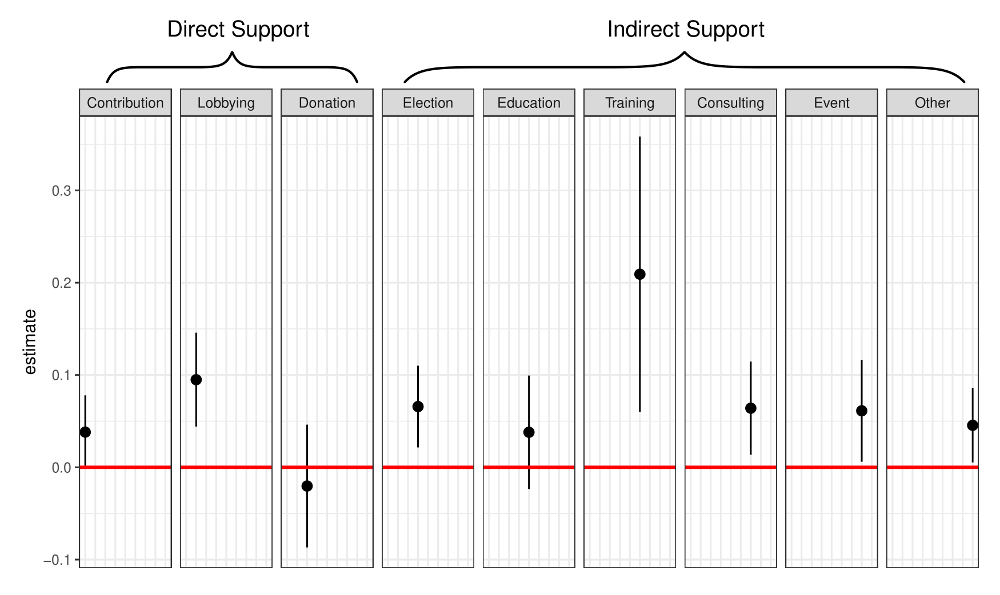

# Matching strategies as robustness checks
   # Matching with TSCS
To further substantiate the findings, I used matching methods for causal inference.21Thismethod allows me to estimate average treatment effect on treated (ATT). As Table 5 shows,the matched data decrease the sample size substantially.  This is mainly because matchingmethods for causal inference with TSCS data only match treated and controlled within thesame time period that has treatment history with lag of 1 time period in this paper.  Table 5shows the ATT of unions’ support on union candidate emergence. The size of effect estimatedas ATT is large that union candidates are about 20% more likely to emerge from a districtwhere unions provide support comparing to a district where unions provide no support.

  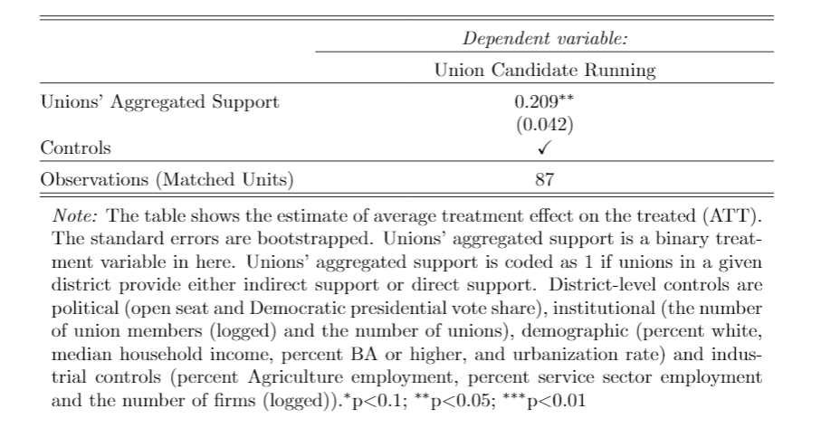

   # Balance in Matching and Adjustment by Weights 
Choosing propensity score matching (PSM) method introduces "avoidable risks" and so researchers should report on what techniques they used to avoid the resulting problems. \citet{king2019propensity}'s main concerns of using PSM is that propsensity score matching can increase imbalance, inefficiency, model dependence, and bias that are the opposite of its intended goal using this PSM. 

Therefore, a user should carefully explain the process of matching and present balance. Figure B.1 is a summary plot of covariate balance before and after conditioning. In a visually appealing and clear way, balance can be presented to demonstrate to readers that balance has been met within a threshold, and that balance has improved after conditioning. As \citet{king2019propensity} state, balance is not always improved after matching. Therefore, in this paper, first, I show the balance in my covariates used and use weighting scheme to adjust imbalance. Also, I need to note that I matched on following covariates: the number of unions, the number of union members, open seat, percent white, percent BA or higher, and recent Democratic Presidential vote share.

logit_matchtable.PNG

  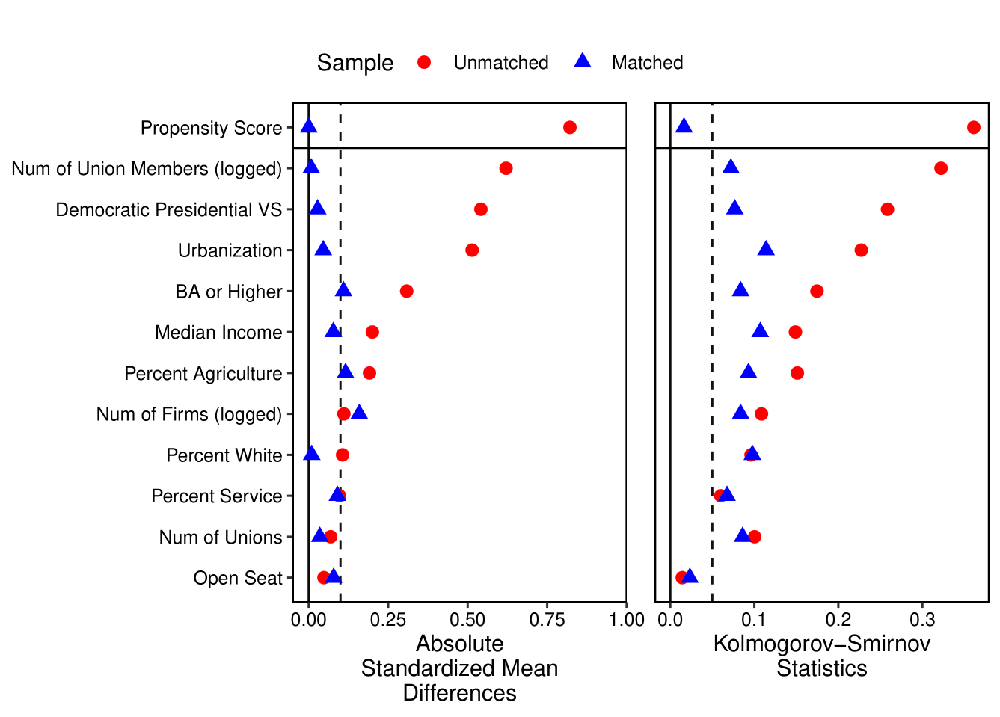
    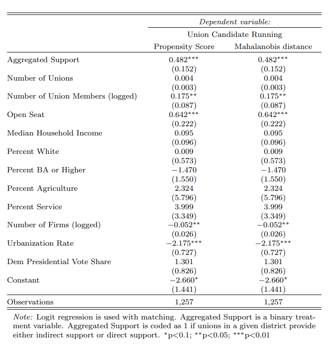

Since the balance of covariates are important to use matching method properly, I need to show the balance of covarites. Bascially, I should assess balance on the covariates of interest from the distance measure. If the balance is not achieve then I should readjust the the distance measure by using weighting scheme. To do this, I use \texttt{cobalt}, R package to assess the balance after matching. As Figure B.1 shows, before adjustment by weighting scheme suggested by Greifer with the R package, \texttt{cobalt} \cite{greifer2018covariate}, five covariates are unbalanced (number of union members, education, percent agriculture, urbanization, and Democratic presidential vote share).\footnote{The weighting method is followed by \citet{austin2008critical}.} Figure B.1 shows that balance was improved on almost all variables after adjustment, bringing all but two below the threshold of 0.1 for absolute mean differences.

Propensity score matching and Mahalanobis Distance Matching (MDM) methods are differetn but similar in that they can fall within the Equal Percent Bias Reducing (EPBR) class \cite{rubin1974estimating,rubin2006affinely}. Coarsened Exact Matching (CEM) is the leading example within the Monotonic Imbalance Bounding (MIB) class \cite{iacus2012causal}. In the later section, I used CEM for MIB class matching\footnote{I matched on the number of unions, the number of union members, open seat, percent white, percent BA or higher, and recent Democratic Presidential vote share.}.

   # Instrumental Variable (Right-to-Work Laws)
The last robustness that I include in this report is instrumentla variable approach. With instrumental variable, a researcher can strengthen the inference, but instrumental varaible approach has several important assumptions that have to met to make correct inference. For instance, the selection of an instrumental varaible is the key. In this section, I use Right-to-work laws (state-level) as the instrument. Right-to-work laws can decrease the political spending of unions \cite{feigenbaum2018bargaining}. Also, this paper finds that the political spending of unions can increase the likelihood of union candidate emergence. These findings provide an opportunity to use instrumental variable as the presence of Right-to-work laws in each states. There are concerns of the violation of "exclusion restriction", using this instrumental variable approach, but the preliminary outcome shows that unions' institutional support can have causal effect on union candidate emergence.

  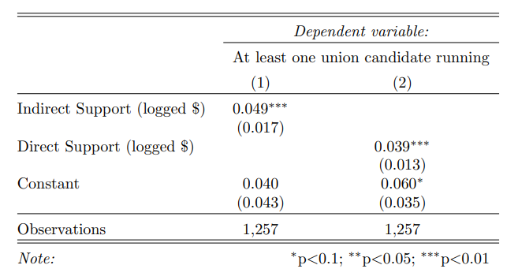  

# Conclusion: Take away
Organizations can incentivize their members to run for office by providing indirect and direct support with organizational capacity.
* Union candidates are more likely to emerge where unions provide higher levels of indirect and direct support during the pre-primary period.

This paper provides the first evidence that organized interests can impact who can emerge as candidates \textbf{before elections start}.
* Particularly, I was able to measure two types of organizational support using micro-level organizational activity data.

# Implications
This paper’s findings establish the importance of organizations and their capacity in candidate emergence.
* Union candidates can represent the working-class. (Burden 2007; Lamare 2016; Lowande, Ritchie and Lauterbach 2019)
* The findings suggest an insight that can explain underrepresentation of certain groups in a society. 
